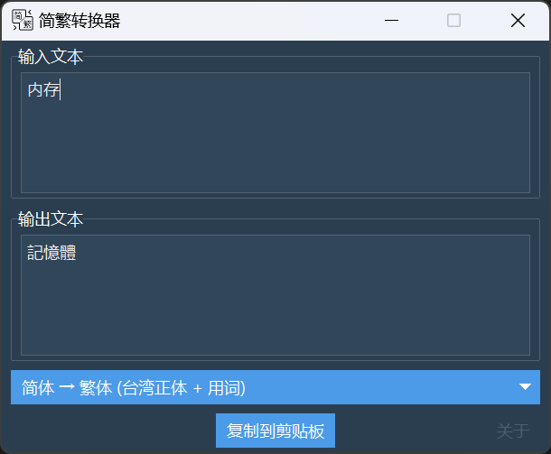

# 简易简繁转换器
 
基于[OpenCC](https://github.com/BYVoid/OpenCC)创建的简体繁体中文转换器

可以方便地将简体中文和繁体中文之间进行转换。

## 功能特点

- 支持多种简繁转换方式，包括：
1. 简体 → 繁体
2. 繁体 → 简体
3. 简体 → 繁体 (台湾正体 + 用词)等。
- 可以将转换后的文本复制到剪贴板，方便粘贴到其他应用程序中使用。

## 使用方法

1. 运行 `main.py` 文件。
2. 选择转换方式。
3. 在输入框中输入要转换的文本，程序会自动转换。
4. 单击 "复制到剪贴板" 按钮可将转换后的文本复制到剪贴板。

## 运行环境要求

- Python 3.x
-  `ttkbootstrap`、`opencc` 和 `pyperclip` 库
-  也可以通过`pip -r requirements.txt`安装所需依赖。

## 许可证

此项目采用 [Apache License](LICENSE) 进行许可。
